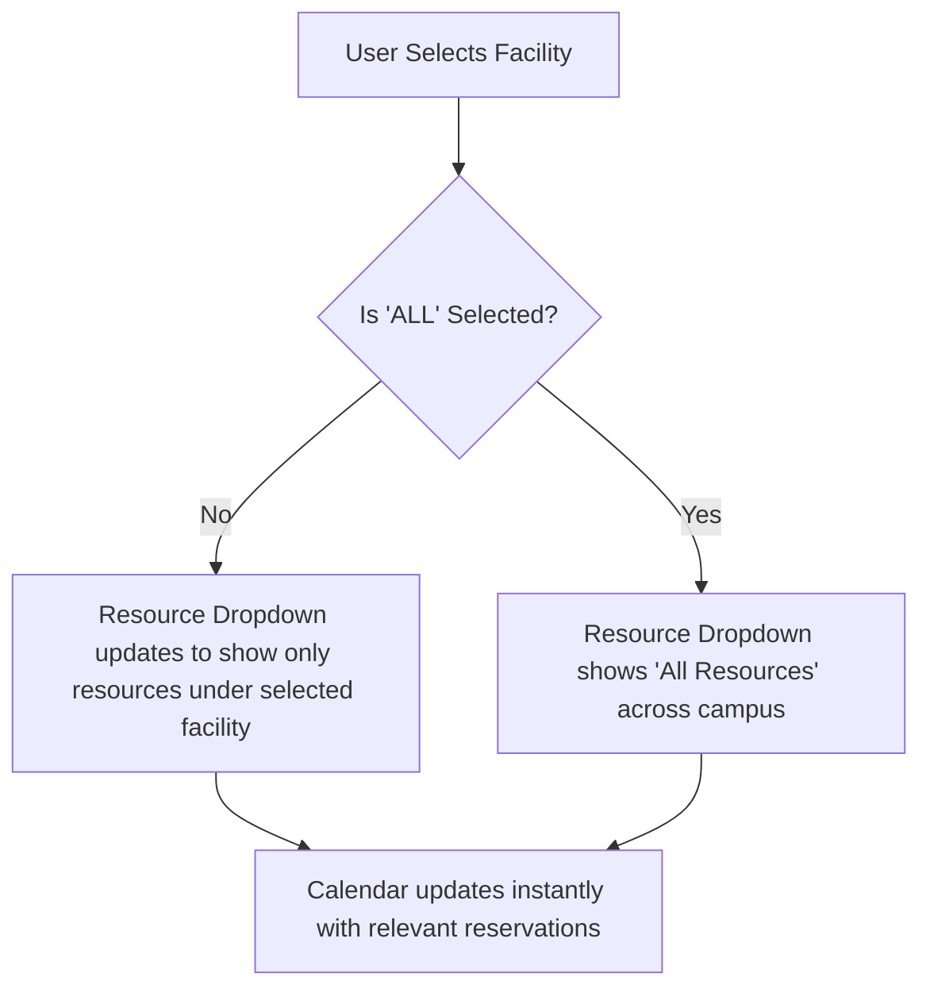

# Calendar Filtering Interaction (USMG6-56)
**Document Ref:** `UIUX-EV-03-FILTERING`

---

## 1. Cascading Filter Logic

To prevent empty searches or invalid combinations, the calendar filtering uses an active cascading relationship between facilities and resources:

### 1.1 Facility Selector
- Lists all active campus buildings.
- Selecting a facility automatically filters the calendar events and restricts the secondary resource dropdown to resources assigned to that facility.

### 1.2 Resource Selector
- When a facility is selected, the resource dropdown lists only matching resources.
- If the user had previously selected a resource belonging to a different facility, the selection automatically resets to `ALL` to prevent orphaned filter states.

### 1.3 URL Query Sync & Bookmarkability
- As the user changes the calendar view, facility, or resource, the URL query parameters update seamlessly (`?view=week&facility=fac-01&resource=res-02`), allowing users to bookmark and share calendar schedules directly.
