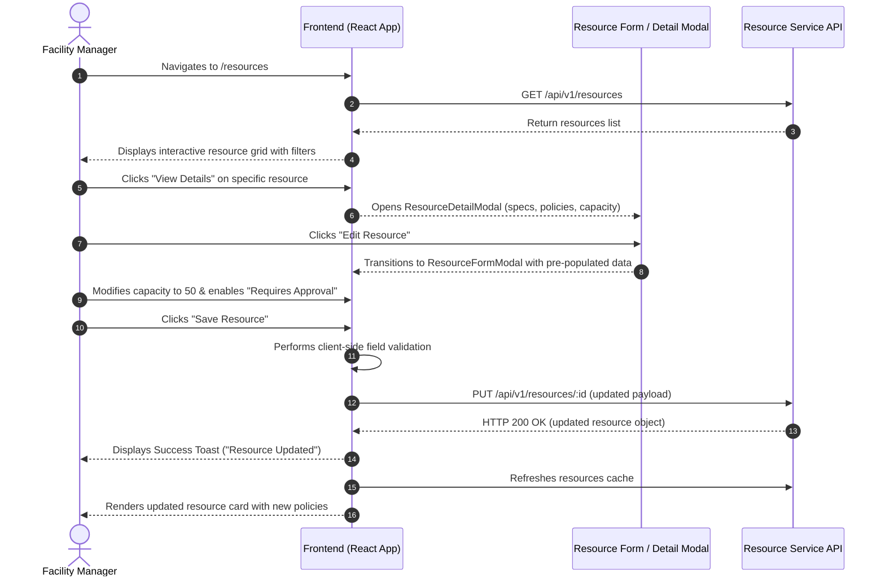

# User Flow 01: Resource Manager Lifecycle Flow
**Role:** `FACILITY_MANAGER` / `ADMIN`  
**Primary Goal:** Inspect, maintain, update, and configure campus resource availability and policies.

---

## 1. Flow Diagram

---

## 2. Step-by-Step Experience Breakdown

1. **Discovery & Exploration:**
   - Manager navigates to `/resources`.
   - Uses the facility filter to isolate resources under their management jurisdiction (e.g., "Faculty of Science").
2. **Detail Review:**
   - Clicks on a resource card to view current utilization, amenity breakdown, and approval requirements.
3. **Configuration & Update:**
   - Clicks "Edit" to adjust capacity or toggle maintenance status.
   - Form validates all fields in real-time.
4. **Instant Synchronization:**
   - Submitting triggers API update; toast notification confirms success.
   - Resource status reflects immediately across the Calendar and Availability search modules.
