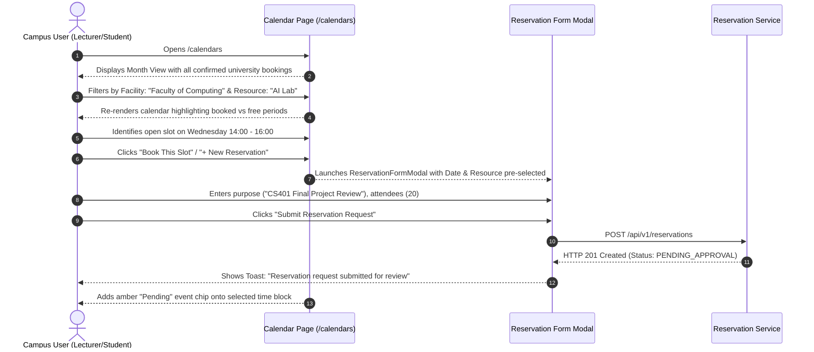

# User Flow 02: End-User Calendar Schedule & Booking Flow
**Role:** `STUDENT` / `LECTURER` / `STAFF`  
**Primary Goal:** Check campus room schedules and reserve an available time block.

---

## 1. Flow Diagram

---

## 2. Key UX Safeguards
- **Conflict Prevention:** System validates against existing confirmed reservations before submission, immediately notifying the user if a selected time block conflicts.
- **Pre-populated Context:** Clicking directly on a calendar date automatically prefills the date and time in the reservation modal, minimizing repetitive typing.
